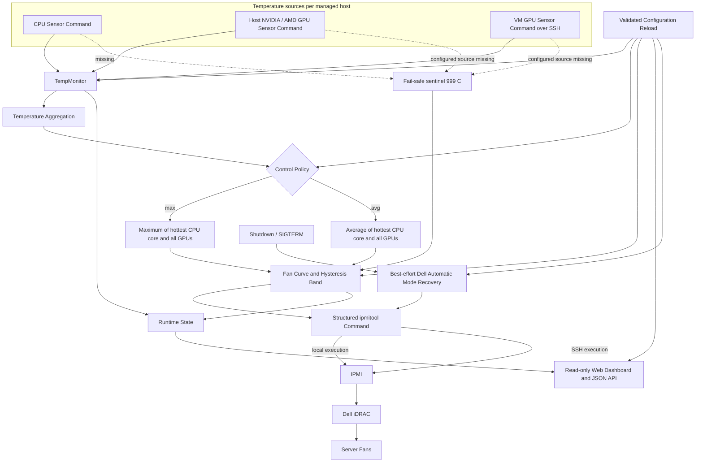

# Architecture and control flow

This document describes the current implementation. It is intentionally narrower than a design proposal: where a deployment assumption differs from the code, the code behavior below is authoritative.

## Components

| Component | Responsibility |
| --- | --- |
| `main.py` | Process lifecycle, per-host loop, aggregation input assembly, Web lifecycle, and configuration reload coordination. |
| `config_loader.py` | YAML defaults, validation, two-point curve expansion, and file-change detection. |
| `temp_monitor.py` | Local or SSH CPU/GPU command execution and semicolon-delimited float parsing. |
| `control_policy.py` | Pure sensor-health decision and `max`/`avg` control-temperature selection. |
| `fan_controller.py` | Fan-curve selection and structured Dell raw IPMI mode/speed commands. |
| `lifecycle.py` | Best-effort restoration of Dell automatic mode for every manual host. |
| `state.py` | In-memory status for monitoring. It is not persistent state or hardware telemetry. |
| `monitoring_web.py` | Read-only dashboard and `/api/status`; no authentication or control operations. |

## Exact aggregation semantics

CPU readings are required. The CPU contribution is the hottest reported CPU core, not the average of all cores. Each reported host and VM GPU temperature is then added to that single CPU value:

- `max`: maximum of the hottest CPU core and all GPU readings;
- `avg`: arithmetic mean of the hottest CPU core and all GPU readings.

GPU data is optional only when no GPU source is configured. If a configured host or VM GPU source returns no usable reading, the whole host enters fail-safe even if other sensors are healthy.

## Fan curve and fail-safe

The selected temperature is compared with the host's ascending `temperatures` and `speeds`. Above the final threshold, the last speed is used. Fail-safe supplies `999.0`, which follows the same path and therefore also selects the last configured speed. The implementation does not issue a separate 100% emergency command.

The current hysteresis implementation is a threshold-centered tolerance band in `compute_fan_speed_level`; it does not store the previously selected curve step. Documentation must not describe it as a stateful delayed-downshift controller.

## Command topology

If `ssh_credentials` are present on a host, both sensor and IPMI commands for that host execute through SSH. Otherwise they execute on the controller. If `ipmi_credentials` are also present, `ipmitool` uses LANPlus to reach the specified iDRAC; without them, it uses the local IPMI interface/default behavior.

VM entries are temperature sources only. Their GPU sensor commands execute with the VM's SSH credentials; fan commands always use the parent host's execution and IPMI settings.

## Reload and recovery

The file watcher detects inode, modification time, and size changes. A candidate must pass full validation before application. Reload first attempts to restore every old manual host to automatic mode; if any restoration fails, the candidate is rejected and the previous configuration is reapplied. Web settings are changed as part of the same reload attempt.

Normal process cleanup and `SIGTERM` also attempt automatic-mode restoration. This is best-effort and cannot run after `SIGKILL`, power loss, or some runtime failures. See [SECURITY.md](SECURITY.md) for the operational safety boundary.
