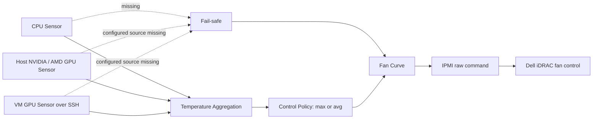

[English](README.md) | [繁體中文](README.zh-TW.md)

# Dell iDRAC Fan Controller with GPU Support

[](https://github.com/kuan909608/dell-idrac-fan-controller-gpu/actions/workflows/ci.yml)
[](LICENSE)
[](https://github.com/kuan909608/dell-idrac-fan-controller-gpu/releases)
[](.github/workflows/ci.yml)

A temperature-driven fan controller for Dell PowerEdge servers whose stock cooling policy does not account well for nonstandard accelerator workloads. It is aimed at Proxmox VE, homelab, local AI server, and other GPU-heavy environments where CPU, host GPU, and passed-through VM GPU temperatures need to influence the same fan curve.

The controller supports CPU sensors, NVIDIA and AMD GPU sensors, VM GPU polling over SSH, multiple hosts, local or remote IPMI execution, systemd and remote-oriented Docker deployment, read-only Web monitoring, missing-sensor fail-safe behavior, and validated runtime configuration reloads.

> [!CAUTION]
> This software sends raw IPMI commands that change physical cooling and may run as root. It cannot guarantee hardware safety or compatibility. Validate it on your exact server, iDRAC firmware, GPUs, sensor commands, and sustained workload. Keep independent thermal alerts and out-of-band access available.

## Use cases

- A Proxmox VE host with one or more GPUs passed through to AI or compute VMs.
- A Dell PowerEdge homelab server whose add-in GPU temperature is not reflected adequately by the stock fan response.
- One controller monitoring several servers and VMs over SSH while sending IPMI commands locally or remotely.
- An operator who needs a loopback-only dashboard and JSON status endpoint without remote control actions.

Hardware support is deliberately not inferred from the Dell product family. The R730 has a historical community report with incomplete details; no model is currently release-verified. See the evidence levels in [COMPATIBILITY.md](COMPATIBILITY.md).

## How it works

For each configured host, the controller polls CPU temperatures and any configured host/VM GPUs. The control policy represents the CPU by its hottest core, combines that value with every available GPU temperature, then selects either the maximum (`max`) or their arithmetic mean (`avg`). The fan curve maps that control temperature to a configured speed and sends it to Dell iDRAC through `ipmitool`.



Missing CPU data, or failure of any configured GPU source, activates the fail-safe sentinel and therefore the last (highest configured) fan-curve speed. This is not necessarily 100%; choose the last speed accordingly. See [ARCHITECTURE.md](ARCHITECTURE.md) for exact behavior and recovery limits.

## Requirements

- Linux with Python 3.11 or 3.13 (the versions exercised by CI).
- `ipmitool`, available where the IPMI command is executed.
- `lm-sensors`/`sensors` for the default CPU command.
- `nvidia-smi` and/or `rocm-smi` where the corresponding GPU is polled.
- IPMI over LAN enabled in iDRAC when using `ipmi_credentials`.
- SSH known-host entries and either a key or password for remote hosts and VMs.

Sensor commands are administrator-provided shell pipelines and must return semicolon-delimited numbers such as `42;47;55`. Unknown SSH host keys are rejected.

## Install with systemd

Use this mode when the controller runs on the server whose local sensors it reads. For a one-command installation on the host, run:

```bash
bash -c "$(curl --proto '=https' --tlsv1.2 -fsSL https://raw.githubusercontent.com/kuan909608/dell-idrac-fan-controller-gpu/v1.1.0-rc.1/install-online.sh)"
```

The bootstrap and downloaded source archive are both pinned to `v1.1.0-rc.1`. Review scripts downloaded from the internet before running them as root. This is a prerelease installer intended for validation before `v1.1.0`.

Alternatively, install from a repository checkout:

```bash
git clone https://github.com/kuan909608/dell-idrac-fan-controller-gpu.git
cd dell-idrac-fan-controller-gpu
sudo ./install.sh
sudo systemctl status fan-control
```

The default installation path is `/opt/fan_control`; pass a different absolute path as the first argument if needed. The installer creates `fan-control.service`, preserves an existing `fan_control_config.yaml`, and restarts the service. Review the generated configuration before enabling manual fan control.

Useful operations:

```bash
sudo journalctl -u fan-control -f
sudo systemctl restart fan-control
sudo systemctl stop fan-control
```

## Install with Docker

The included image is intended for remote management: it includes `ipmitool`, but not host CPU/GPU sensor packages or device access. Do not assume that mounting `/dev` or `/sys` alone enables local sensor collection.

```bash
git clone https://github.com/kuan909608/dell-idrac-fan-controller-gpu.git
cd dell-idrac-fan-controller-gpu
mkdir -p config keys
cp fan_control_config.yaml.example config/fan_control_config.yaml
chmod 600 config/fan_control_config.yaml
test -f "$HOME/.ssh/known_hosts"
docker compose up -d --build
docker compose logs -f
```

The Compose file mounts the configuration directory, `keys/`, and the operator's `known_hosts`; it publishes the dashboard only on `127.0.0.1:8080`. Set `general.web_host: 0.0.0.0` inside the container so the loopback-published port can reach it. Use `docker compose down` for a graceful stop.

The equivalent standalone command is:

```bash
docker build -t dell-idrac-fan-controller-gpu:local .
docker run -d --name fan_control --restart unless-stopped --init --stop-timeout 30 \
  -p 127.0.0.1:8080:8080 \
  -v "./config:/config:ro" \
  -v "./keys:/app/keys:ro" \
  -v "$HOME/.ssh/known_hosts:/root/.ssh/known_hosts:ro" \
  dell-idrac-fan-controller-gpu:local
```

Run only one controller for a given server. Competing systemd, Docker, or standalone processes can overwrite each other's fan mode and speed.

## Configuration

Copy [fan_control_config.yaml.example](fan_control_config.yaml.example) and replace every example address and credential. The example starts with `debug: true`; confirm all sensor and planned IPMI output before changing it to `false`. Core settings are:

| Key | Meaning |
| --- | --- |
| `general.debug` | Dry-run IPMI changes and enable additional logging. Sensor commands still execute. |
| `general.interval` | Seconds between control cycles; must be greater than zero. |
| `general.temperature_control_mode` | `max` or `avg`; see the aggregation definition above. |
| `general.web_enabled` | Enable the read-only dashboard and JSON endpoint. |
| `general.web_host`, `web_port` | Bind address and port; defaults are `127.0.0.1:8080`. |
| `general.web_refresh_interval` | Dashboard refresh period, from 1 to 3600 seconds. |
| `*_temperature_command` | Trusted shell command returning semicolon-delimited temperatures. |
| `hosts[].fan_control_mode` | `manual` for script control or `automatic` for Dell control. |
| `hosts[].temperatures`, `speeds` | Matching ascending lists with at least two entries; speeds are 0–100. |
| `hosts[].hysteresis` | Non-negative threshold tolerance used by the current fan-curve calculation. |
| `hosts[].ipmi_credentials` | Optional iDRAC host, username, and password. |
| `hosts[].ssh_credentials` | Optional execution host, username, and password or `key_path`. |
| `hosts[].gpu_type` | Optional `nvidia`, `amd`, or a list containing both. |
| `hosts[].vms` | Optional VM name, SSH credentials, and required GPU type. |

When exactly two thresholds and speeds are supplied with hysteresis greater than zero, the loader expands them into intermediate points. For example, `[40, 80]`, `[20, 80]`, and hysteresis `5` become thresholds `[40, 50, 60, 70, 80]` and speeds `[20, 35, 50, 65, 80]`.

The configuration file is checked before each control cycle. A changed file is fully validated; invalid updates are rejected and the last valid configuration stays active. Before applying a valid replacement, all previously manual hosts must be restored to Dell automatic mode. Web bind and refresh settings are reloaded too.

## Web monitoring

The built-in service exposes `GET /` and `GET /api/status`. It reports host and VM sensor health, CPU/GPU temperatures, control temperature, current script/iDRAC/dry-run state, last commanded fan speed, and update time. Mutation methods return `405`, and credentials are not included.

Keep the default loopback binding and use a tunnel for remote access:

```bash
ssh -L 8080:127.0.0.1:8080 operator@controller-host
```

The Web service has no authentication or TLS. Do not expose it directly to an untrusted network.

## Safety and recovery

- Set the final configured speed high enough for your worst expected workload; fail-safe uses that value, not an unconditional 100% command.
- Normal shutdown, `SIGTERM`, and accepted configuration reloads attempt to restore Dell automatic fan mode on every host configured as `manual`.
- Recovery is best-effort. Power loss, `SIGKILL`, process/runtime failure, network loss, bad credentials, or an unavailable iDRAC can leave the last manual setting active.
- Test sensor loss, graceful shutdown, controller-host restart, and iDRAC reachability before unattended operation. Confirm the resulting state through iDRAC, not only the dashboard.
- Store IPMI/SSH credentials in a mode-`0600` configuration, prefer restricted SSH keys, and never commit secrets. Root execution and trusted shell sensor commands expand the impact of a compromised configuration.

Read the full [Security Policy](SECURITY.md) and [hardware compatibility criteria](COMPATIBILITY.md) before deployment.

## Relationship to upstream

This repository originated from [nmaggioni/r710-fan-controller](https://github.com/nmaggioni/r710-fan-controller). The upstream project established the CPU-core-based IPMI fan-control approach, remote/multi-host operation, configuration, and shutdown recovery on which this project was built.

This fork has continued evolving for GPU, virtualization, multi-host, and current deployment scenarios. Its main additions and redesigns include:

- host and VM NVIDIA/AMD GPU collection, with combined CPU/GPU policy;
- explicit missing-sensor fail-safe decisions and observable runtime health;
- modular configuration, sensing, policy, IPMI, lifecycle, state, and Web components;
- a read-only dashboard and JSON monitoring endpoint;
- validated runtime configuration and Web-setting reloads;
- safer IPMI password handling, SSH host-key verification, and redacted debug output;
- hardened systemd packaging, remote-oriented Docker/Compose deployment, CI, and regression tests.

These changes reflect a different operating scope, not a criticism of upstream. Historical credits and the original MIT copyright attribution are retained.

## Project governance

- Changes and notable history: [CHANGELOG.md](CHANGELOG.md)
- Draft first release notes: [RELEASE_NOTES.md](RELEASE_NOTES.md)
- Contribution guide: [CONTRIBUTING.md](CONTRIBUTING.md)
- Release process: [RELEASING.md](RELEASING.md)
- Security reports: [SECURITY.md](SECURITY.md)
- Compatibility reports: [COMPATIBILITY.md](COMPATIBILITY.md)

## Credits and license

Thanks to [NoLooseEnds](https://github.com/NoLooseEnds/Scripts/tree/master/R710-IPMI-TEMP) for the core IPMI directions, [sulaweyo/r710-fan-control](https://github.com/sulaweyo/r710-fan-control) for the automation inspiration, and especially [Niccolò Maggioni's r710-fan-controller](https://github.com/nmaggioni/r710-fan-controller), from which this repository originated.

Released under the [MIT License](LICENSE). The license retains `Copyright (c) 2019 Niccolò Maggioni`.
