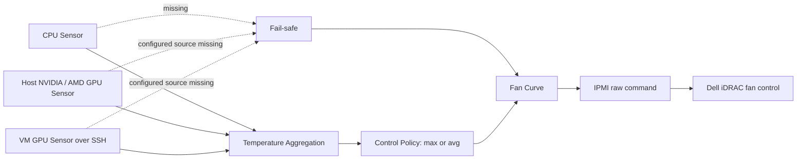

[English](README.md) | [繁體中文](README.zh-TW.md)

# Dell iDRAC 風扇控制器（支援 GPU）

[](https://github.com/kuan909608/dell-idrac-fan-controller-gpu/actions/workflows/ci.yml)
[](LICENSE)
[](https://github.com/kuan909608/dell-idrac-fan-controller-gpu/releases)
[](.github/workflows/ci.yml)

這是一套以溫度驅動的 Dell PowerEdge 風扇控制器，適合原廠散熱策略未能充分反映非標準加速器工作負載的環境。主要使用情境包括 Proxmox VE、homelab、本地 AI server 與其他 GPU 密集型系統，讓 CPU、主機 GPU 與 passthrough VM GPU 溫度共同影響同一條風扇曲線。

控制器支援 CPU sensor、NVIDIA 與 AMD GPU sensor、透過 SSH 讀取 VM GPU、多主機、本機或遠端執行 IPMI、systemd、以遠端管理為主的 Docker 部署、唯讀 Web monitoring、sensor 遺失時的 fail-safe，以及經驗證的 runtime configuration reload。

> [!CAUTION]
> 本軟體會傳送 raw IPMI 指令改變實體散熱狀態，並可能以 root 執行。它無法保證硬體安全或相容性。請在實際伺服器、iDRAC 韌體、GPU、sensor command 與持續負載上驗證，並保留獨立溫度告警及帶外管理能力。

## 使用情境

- GPU passthrough 給 AI 或運算 VM 的 Proxmox VE 主機。
- 加裝 GPU 後，原廠風扇反應未能充分反映 GPU 溫度的 Dell PowerEdge homelab。
- 由單一控制器透過 SSH 監測多台伺服器與 VM，並於本機或遠端送出 IPMI 指令。
- 需要 loopback-only 儀表板與 JSON 狀態端點，但不需要遠端控制 API 的環境。

本專案不會由 Dell 產品家族推定硬體相容性。R730 僅有細節不完整的歷史 community report；目前沒有任何機型達到正式版本的 Verified 標準。證據分級請見 [COMPATIBILITY.md](COMPATIBILITY.md)。

## 運作方式

控制器會依序讀取各主機的 CPU 溫度，以及所有已設定的主機／VM GPU。控制策略以最熱 CPU core 代表 CPU，再與每個 GPU 溫度合併，依設定選擇最大值（`max`）或這組數值的算術平均（`avg`）。風扇曲線將控制溫度對應為轉速，再由 `ipmitool` 傳送到 Dell iDRAC。



CPU 資料遺失，或任何已設定的 GPU 來源失敗時，會啟動 fail-safe sentinel，因此落到風扇曲線最後一個（最高設定）轉速。該值不一定是 100%；請據此設定最後一段速度。精確行為與 recovery 限制請見 [ARCHITECTURE.md](ARCHITECTURE.md)。

## 環境需求

- Linux 與 Python 3.11 或 3.13（CI 實際測試的版本）。
- 在執行 IPMI 指令的位置可使用 `ipmitool`。
- 預設 CPU 指令需要 `lm-sensors`／`sensors`。
- 對應 GPU 被讀取的位置需要 `nvidia-smi` 與／或 `rocm-smi`。
- 使用 `ipmi_credentials` 時，iDRAC 必須啟用 IPMI over LAN。
- 遠端主機與 VM 需要 SSH known-host 記錄，以及 key 或 password。

Sensor command 是由管理者提供的 shell pipeline，輸出必須是以分號分隔的數字，例如 `42;47;55`。未知 SSH host key 會被拒絕。

## 使用 systemd 安裝

控制器需直接讀取伺服器本機 sensor 時，建議使用此方式。請從 repository checkout 執行：

```bash
git clone https://github.com/kuan909608/dell-idrac-fan-controller-gpu.git
cd dell-idrac-fan-controller-gpu
sudo ./install.sh
sudo systemctl status fan-control
```

預設安裝路徑是 `/opt/fan_control`；如需修改，可將其他絕對路徑作為第一個參數。Installer 會建立 `fan-control.service`、保留既有 `fan_control_config.yaml` 並重新啟動服務。啟用手動控制前，請先檢查產生的設定檔。

常用操作：

```bash
sudo journalctl -u fan-control -f
sudo systemctl restart fan-control
sudo systemctl stop fan-control
```

## 使用 Docker 安裝

內附 image 以遠端管理為目標：它包含 `ipmitool`，但不包含主機 CPU/GPU sensor 套件與裝置存取。請勿假設只掛載 `/dev` 或 `/sys` 就能讀取本機 sensor。

```bash
git clone https://github.com/kuan909608/dell-idrac-fan-controller-gpu.git
cd dell-idrac-fan-controller-gpu
mkdir -p config keys
cp fan_control_config.yaml.example config/fan_control_config.yaml
chmod 600 config/fan_control_config.yaml
test -f "$HOME/.ssh/known_hosts"
docker compose up -d --build
docker compose logs -f
```

Compose 會掛載設定目錄、`keys/` 與操作者的 `known_hosts`，並只將儀表板發布於 `127.0.0.1:8080`。容器內需設定 `general.web_host: 0.0.0.0`，loopback-published port 才能連入。請使用 `docker compose down` 正常停止。

等效的 standalone 指令如下：

```bash
docker build -t dell-idrac-fan-controller-gpu:local .
docker run -d --name fan_control --restart unless-stopped --init --stop-timeout 30 \
  -p 127.0.0.1:8080:8080 \
  -v "./config:/config:ro" \
  -v "./keys:/app/keys:ro" \
  -v "$HOME/.ssh/known_hosts:/root/.ssh/known_hosts:ro" \
  dell-idrac-fan-controller-gpu:local
```

同一台伺服器只能由一個 controller 管理。同時執行 systemd、Docker 或 standalone process，可能互相覆寫風扇模式與速度。

## 設定

複製 [fan_control_config.yaml.example](fan_control_config.yaml.example)，並替換所有範例地址與憑證。範例預設為 `debug: true`；請先確認所有 sensor 與 planned IPMI 輸出，再改成 `false`。主要設定如下：

| 參數 | 意義 |
| --- | --- |
| `general.debug` | Dry-run IPMI 變更並增加 log；sensor command 仍會執行。 |
| `general.interval` | 控制週期秒數，必須大於零。 |
| `general.temperature_control_mode` | `max` 或 `avg`；彙整定義如上。 |
| `general.web_enabled` | 啟用唯讀 dashboard 與 JSON endpoint。 |
| `general.web_host`, `web_port` | Bind address 與 port；預設為 `127.0.0.1:8080`。 |
| `general.web_refresh_interval` | Dashboard 更新週期，範圍 1–3600 秒。 |
| `*_temperature_command` | 受信任、回傳分號分隔溫度的 shell command。 |
| `hosts[].fan_control_mode` | `manual` 由程式控制；`automatic` 由 Dell 控制。 |
| `hosts[].temperatures`, `speeds` | 至少兩個、數量相同且遞增的清單；速度為 0–100。 |
| `hosts[].hysteresis` | 目前風扇曲線計算使用的非負門檻容許區間。 |
| `hosts[].ipmi_credentials` | 選填的 iDRAC host、username 與 password。 |
| `hosts[].ssh_credentials` | 選填的執行主機、username，以及 password 或 `key_path`。 |
| `hosts[].gpu_type` | 選填 `nvidia`、`amd`，或包含兩者的 list。 |
| `hosts[].vms` | 選填 VM 名稱、SSH credentials 與必要的 GPU type。 |

若只提供兩個 threshold 與 speed，且 hysteresis 大於零，loader 會產生中間點。例如 `[40, 80]`、`[20, 80]` 與 hysteresis `5` 會變成 thresholds `[40, 50, 60, 70, 80]`、speeds `[20, 35, 50, 65, 80]`。

每次控制週期前都會檢查設定檔。變更後的檔案必須完整通過驗證；無效變更會被拒絕，並保留上一份有效設定。套用有效設定前，所有原本為 `manual` 的主機都必須成功恢復 Dell automatic mode。Web bind 與 refresh 設定也會一起 reload。

## Web monitoring

內建服務提供 `GET /` 與 `GET /api/status`，顯示 host/VM sensor health、CPU/GPU 溫度、控制溫度、script/iDRAC/dry-run 狀態、最近下達的 fan speed 與更新時間。修改方法回傳 `405`，輸出不包含 credentials。

請保留預設 loopback binding，遠端查看時使用 tunnel：

```bash
ssh -L 8080:127.0.0.1:8080 operator@controller-host
```

Web service 不提供 authentication 或 TLS，請勿直接暴露於不受信任的網路。

## 安全與恢復

- 最後一段 speed 應足以應付最嚴苛的預期負載；fail-safe 使用此值，不會無條件送出 100%。
- 正常關閉、`SIGTERM` 與接受設定 reload 時，會嘗試將每台設定為 `manual` 的主機恢復 Dell automatic fan mode。
- Recovery 是 best-effort。斷電、`SIGKILL`、process/runtime failure、網路中斷、錯誤 credentials 或 iDRAC 無法連線，都可能讓最後的 manual 設定繼續生效。
- 無人值守前，請測試 sensor loss、graceful shutdown、controller host reboot 與 iDRAC reachability，並直接由 iDRAC 確認結果，不要只看 dashboard。
- IPMI/SSH credentials 應放在 mode `0600` 的設定檔，優先使用受限制的 SSH key，且不可 commit secret。Root execution 與可信任 shell sensor command 會放大設定遭竄改時的影響。

部署前請完整閱讀 [Security Policy](SECURITY.md) 與 [硬體相容性標準](COMPATIBILITY.md)。

## 與 upstream 的關係

本 repository 源自 [nmaggioni/r710-fan-controller](https://github.com/nmaggioni/r710-fan-controller)。Upstream 建立了 CPU-core-based IPMI 風扇控制方法、遠端／多主機操作、設定及 shutdown recovery，成為本專案持續發展的基礎。

這個 fork 後續針對 GPU、虛擬化、多主機與現代部署情境持續演進，主要新增與重新設計包括：

- 主機與 VM 的 NVIDIA／AMD GPU 收集，以及 CPU/GPU 組合策略；
- 明確的 sensor 遺失 fail-safe 判定及可觀測 runtime health；
- 模組化的設定、sensor、policy、IPMI、lifecycle、state 與 Web 元件；
- 唯讀 dashboard 與 JSON monitoring endpoint；
- 經驗證的 runtime configuration 與 Web setting reload；
- 更安全的 IPMI password 傳遞、SSH host-key verification 與 debug redaction；
- 強化的 systemd packaging、remote-oriented Docker/Compose、CI 與 regression tests。

這些差異代表使用範圍不同，不是對 upstream 的批評。歷史 Credits 與原始 MIT copyright attribution 均完整保留。

## 專案治理

- 變更與重要歷史：[CHANGELOG.md](CHANGELOG.md)
- 第一版 Release Notes 草稿：[RELEASE_NOTES.md](RELEASE_NOTES.md)
- 貢獻指南：[CONTRIBUTING.md](CONTRIBUTING.md)
- Release 流程：[RELEASING.md](RELEASING.md)
- 安全回報：[SECURITY.md](SECURITY.md)
- 相容性回報：[COMPATIBILITY.md](COMPATIBILITY.md)

## 致謝與授權

感謝 [NoLooseEnds](https://github.com/NoLooseEnds/Scripts/tree/master/R710-IPMI-TEMP) 提供核心 IPMI 指引、[sulaweyo/r710-fan-control](https://github.com/sulaweyo/r710-fan-control) 提供自動化靈感，尤其感謝本 repository 的來源 [Niccolò Maggioni 的 r710-fan-controller](https://github.com/nmaggioni/r710-fan-controller)。

本專案採用 [MIT License](LICENSE)，並保留 `Copyright (c) 2019 Niccolò Maggioni`。
